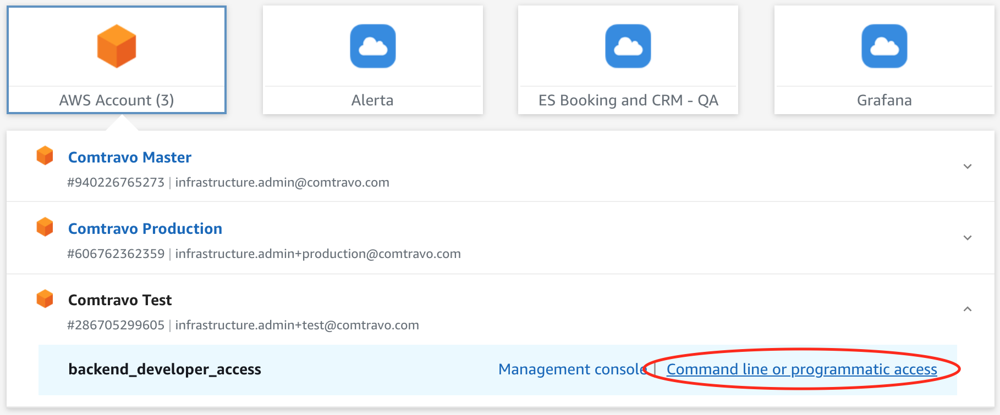
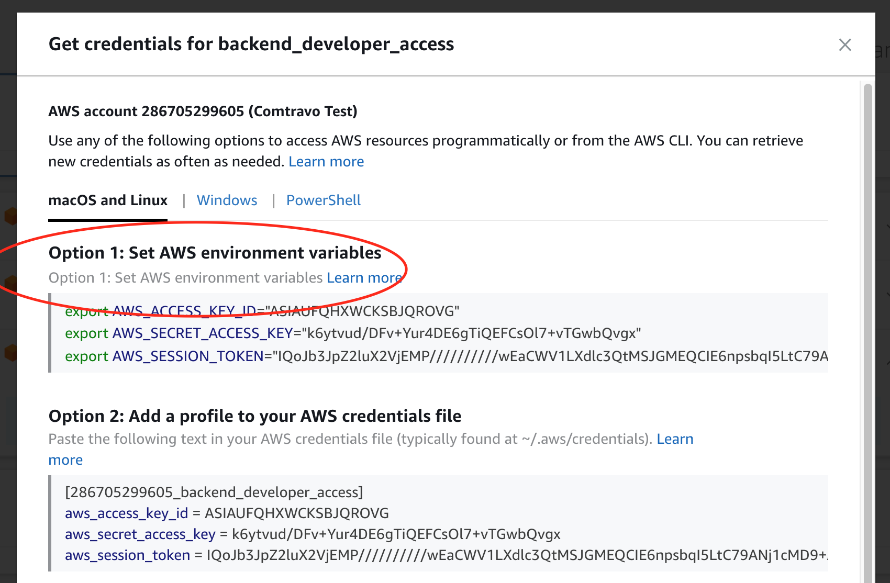

# AWS CLI authentication with ENV vars

AWS authentication MAY be required for 2 reasons:
- access to AWS resources with aws-sdk (eg, list-s3 EP)
- export of traces to AWS X-Ray by otel-collector (if enabled)

## Login to AWS

on https://ct-backend.awsapps.com/start#/ with "Command line or programmatic access":

## Set local env vars

by copy-pasting command from AWS UI:

They will further be used in docker-compose.yaml
